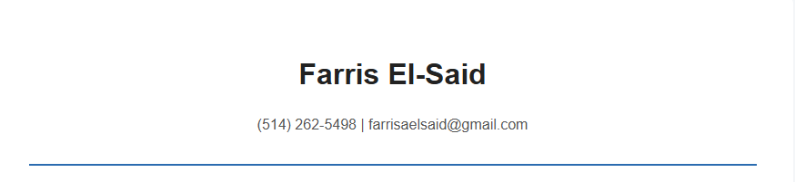
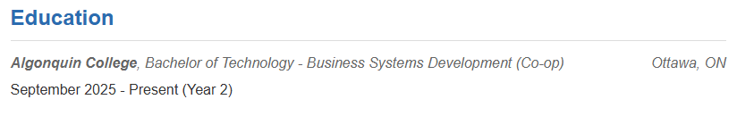
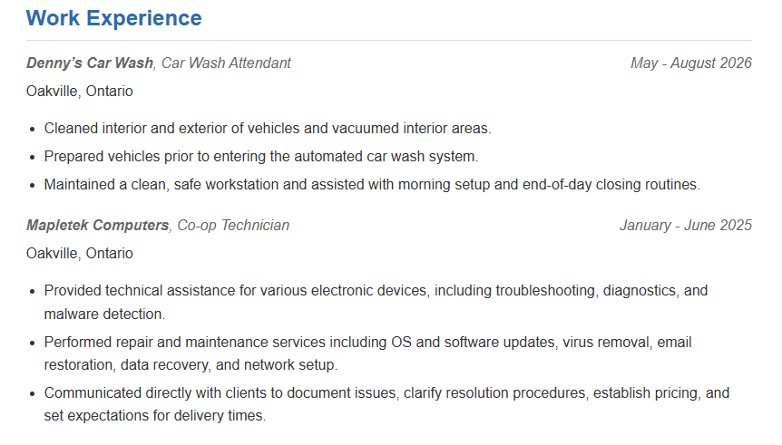
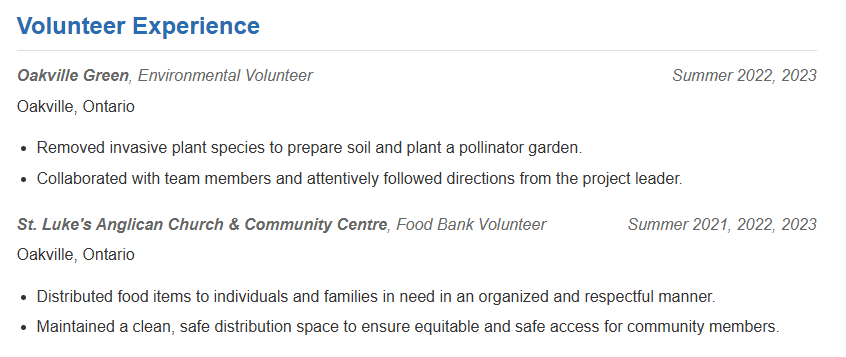
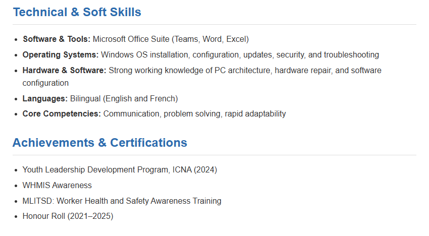

# Farris El-Said's Portfolio Design System Documentation

This documentation provides a clear and simplified overview of the design system used for my portfolio project. It includes the colors, typography, components, and layout used throughout the design, along with screenshots of the webpage.

## **1. Color Palette**

I used a simple and professional color palette throughout the design.

- **Primary Color:** `#2b6cb0`
- **Text Color:** `#333`
- **Heading Color:** `#222`
- **Secondary Text Color:** `#555`
- **Secondary Information Color:** `#666`
- **Border Color:** `#ddd`
- **Background Color:** `#f4f6f8`
- **Container Background:** `#ffffff`

The blue color is mainly used for section headings and the line underneath the header. The light gray background and white container create a clean and professional appearance.

## **2. Typography**

- **Body Text:** `Arial, sans-serif`
- **Main Heading:** `Arial, sans-serif`, 32px
- **Section Headers:** `Arial, sans-serif`

Arial was selected because it is simple, professional, and easy to read.

## **3. Components and Layout**

### Header

- **Design:** Centered name and contact information with a blue line underneath.
- **Screenshot:**

### Education

- **Design:** Education information is organized with the school and program on the left and the location on the right. The date is displayed underneath.
- **Screenshot:**

### Work Experience

- **Design:** Work experience is organized using resume items. The employer and position are displayed on the left, while the dates are displayed on the right. Location and responsibilities are displayed underneath.
- **Screenshot:**

### Volunteer Experience

- **Design:** Volunteer experience follows the same layout as the work experience section to keep the design consistent.
- **Screenshot:**

### Skills and Achievements

- **Design:** Technical skills, soft skills, and achievements are displayed using bullet-point lists. Consistent spacing is used between each item.
- **Screenshot:**

## **4. Overall Layout**

- **Page Background:** Light gray
- **Main Content:** Centered white container
- **Maximum Width:** 800px
- **Container Padding:** 40px
- **Section Spacing:** 25px
- **Header Alignment:** Centered
- **Resume Item Alignment:** Flexbox with information on the left and dates on the right

The layout is designed to keep the resume organized, readable, and professional.

## **5. Conclusion**

This documentation provides a concise reference for the design system used in my portfolio project. The design focuses on readability, simple colors, consistent spacing, and a professional layout.